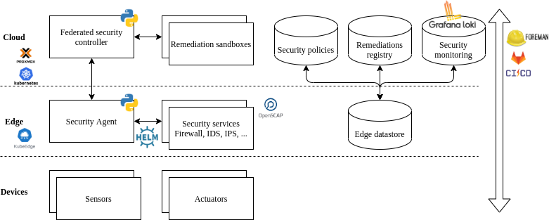

# vacsine 

Adaptive continuous security orchestration in polymorphous environments
----------

Vacsine is an open-source security orchestration, automation and response tool that provides adaptive security for distributed systems. It relies on continuous monitoring of Cloud and Edge systems to define, evaluate and apply automated countermeasures such as firewalls, intrusion detection systems, honeypots or quarantining. The automated response is triggered by changes to security requirements, indicators of compromise, incidents and vulnerabilities. The efficiency and speed of countermeasures deployment is evaluated in automatically provisioned sandbox environments that shadow the target Cloud/Edge systems. Those sandboxes provide observability and scalability for the training and maintenance of security response strategies.

Use cases
-------

1. Enforce security policies on cloud/edge infrastructures based on certification criteria
2. Continuous security self-assessment based on DevSecOps practices

Requirements
-------

### 1. Orchestration of the adaptive security response

* Input: security policy, target system description
* Output: verified remediation execution

1. create a test sandbox containing a clone of the target system
2. analyse the security policy and deduce a remediation workflow
3. apply remediation to the test sandbox
4. check security requirements against test sandbox
5. apply remediation to the target system
6. check security requirements against target system

### 2. Observability of the security policy orchestration

* Input: remediation workflow, target system description
* Output: remediation logs

1) apply remediation workflow to the system
2) check remediation workflow execution status: execution logs for each remediation step should contain details on the execution for tracability (start time, duration, informative, error messages, ...)

Architecture
-------

Vacsine is composed of several modules that are deployed in Cloud and Edges infrastructures:

### Federated Security Controller

* management of the security remediation on the target system
* consolidated view of the remediations history and states across the various edges and clouds

### Security policies

* registry of the **security policies** of the system

### Remediation registry

* contains templates and workflows of security remediations

### Security monitoring

* remediation execution logs, 
* results of vulnerability scans, 
* threat indicators, etc.

### Security Agent

* deployed on each edge and cloud
* provides security remediations based on the detection of various events and the matching of those events to **remediation workflows**, those are triggered by:
  * changes to security requirements,
  * threat indicators,
  * incidents,
  * vulnerabilities
* _can_ operate in autonomous mode to provide quicker response time to events happening in the edge they are deployed on, and continued operation in case the edge-cloud connexion is degraded. The **edge datastore** contains a local version of the security policies, remediations catalog and security monitoring information.

### Security Services

* Vulnerability remediation in the form of **security services**:
  * firewalls, 
  * penetration tests, 
  * intrusion detection systems, 
  * honeypots, etc. 

### Remediation sandboxes

* test remediation workflows in a dedicated environment before applying them
* training of new remediation strategies

### Implementation

The orchestration of the security services is provided by VaCSIne, it is written as Python microservices. The Security Agent orchestrates the deployment and configuration of the security services (firewalls, vulnerability scanners, honeypots, etc.) using [Ansible](https://www.ansible.com/) playbooks and [Helm](https://helm.sh/) charts.

Security services orchestration and execution produce traces that can be monitored. VaCSIne produces logs of the orchestration, for instance when a new service is deployed or reconfigured. Security services will also output traces, for example a vulnerability scan with OpenSCAP will produce execution logs and a vulnerability scan report. [Grafana Loki](https://grafana.com/oss/loki/) provides management and visualisation of the logs and security events in the system.

### Deployment

The software is implemented and deployable as follows:

* A Private Cloud infrastructure managed by the [Proxmox Virtual Environment](https://proxmox.com/en/proxmox-ve) open-source server management platform. [Kubernetes](https://kubernetes.io/) provides container orchestration, clusters are managed using the [Rancher](https://rancher.com/) solution. The cloud is connected to the Edge nodes devices using the [KubeEdge](https://kubeedge.io/) system, which provides container orchestration at the Edge,
* Edge devices can be composed for example of of SBC's (Single Board Computers), they provide advanced compute capabilities (GPU) for edge security services. 
 
This infrastructure offers scalable on-demand compute resources to support load variations and disruptions. The continuous integration, deployment and assessment processes are supported by the [GitLab](https://gitlab.com) and [Foreman](https://www.theforeman.org/) platforms.
